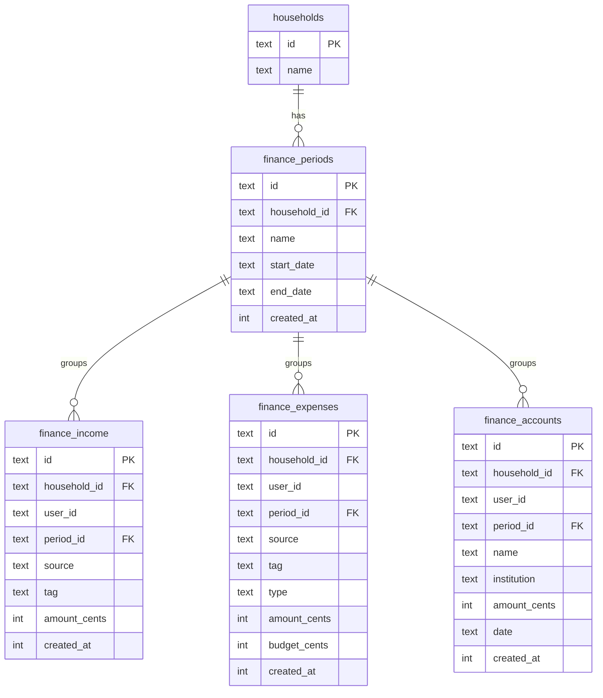
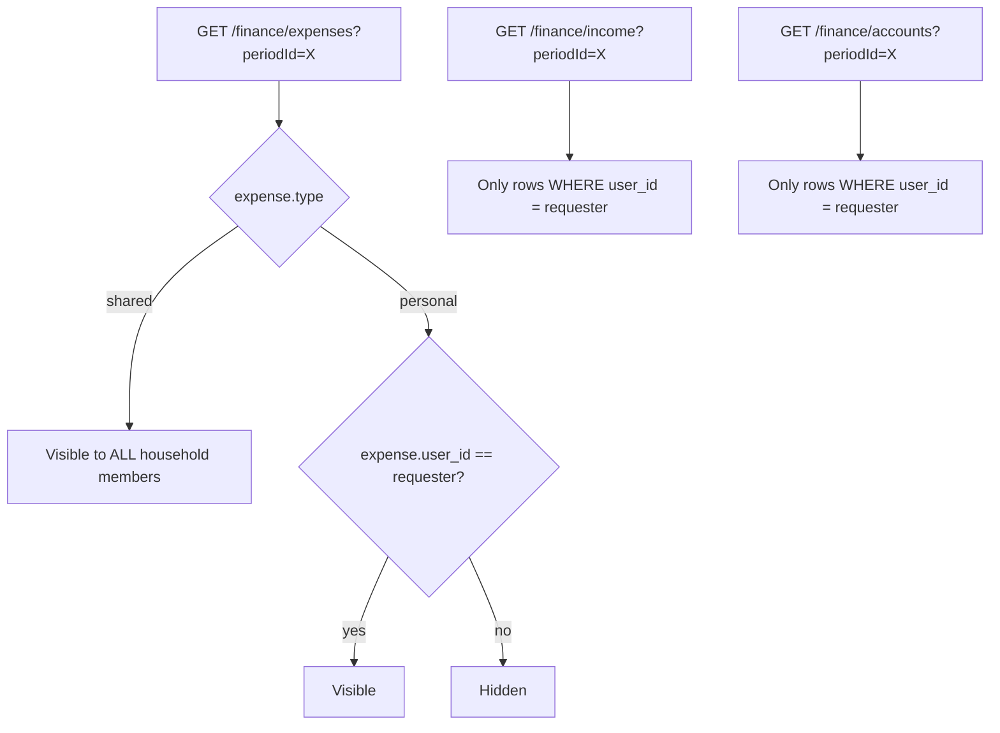
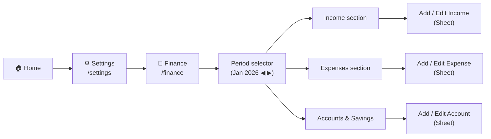
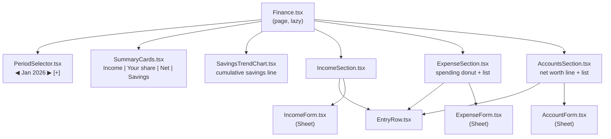
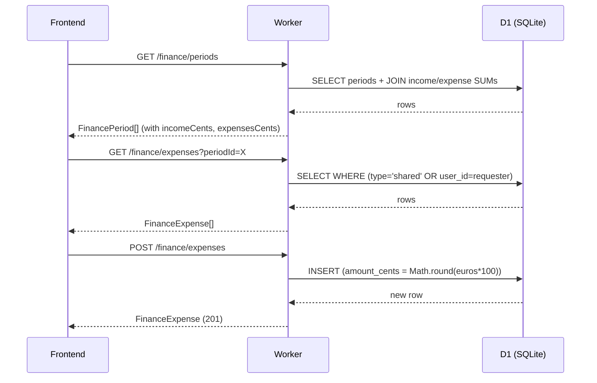

# Finance Tracking Area — Plan

## What we're building

A Finance area in Casita that replicates the user's Notion finance tracker. Accessible via **Settings → Finance** (not a main tab). Supports manual entry and JSON import.

Modelled on four Notion databases: **Budgeting** (the monthly hub), **Income**, **Expenses**, and **Savings & Investments**.

---

## Integration with the areas/tabs system

Finance is registered as an `AreaId` (`'finance'`) in `frontend/src/api/areas.ts`. It integrates with the Phase 1 area enable/disable system (PR #57) as follows:

- **HouseholdSettings.tsx** — Finance toggle appears in the owner section alongside Calendar, Todos, Shopping, Recipes
- **SettingsMenu.tsx** — Finance entry guarded by `isAreaEnabled(areasConfig, 'finance')`; hidden when disabled
- **App.tsx** — `/finance` route redirects to `/settings` when Finance is disabled
- **Not a pinnable tab** — Finance does not appear in the Phase 2 tab-pin section (it is a Settings sub-area, not a bottom-nav tab)

---

## Key design decisions

### Custom tracking periods, not calendar months

The user is paid on approximately the working day before the 25th of each month and tracks finances from that date to the next. Periods are user-defined with a free-text name, a `start_date`, and an `end_date`. The "New period" dialog auto-suggests start = previous period's end + 1 day.

### Per-line budgeting

Each expense entry has both an `amount_cents` (actual spend) and a `budget_cents` (what was planned). The period summary can then show Budget vs Actual, not just a total spend figure.

### Privacy: shared expenses split by household size

Expenses carry a `type` field (`'shared' | 'personal'`). The API returns shared expenses to all household members and personal expenses only to the owner. Shared expense amounts are divided by household member count on the frontend to show each person's share — matching the "Individual amount" formula in Notion.

Income and account snapshots are always private (user-scoped).

### Amounts stored as integer cents

`€12.50` → `1250`. Avoids floating-point precision issues throughout the stack.

---

## Data model



---

## Privacy model



---

## Navigation flow



---

## Frontend component tree



---

## Charts (Recharts via shadcn/ui)

Four charts, shown only when enough data exists (≥2 periods):

| Chart | Where | Type | Data source |
|-------|-------|------|-------------|
| Spending by category | ExpenseSection header | Donut | Current period expenses grouped by `tag` |
| Income vs Expenses | SummaryCards | Grouped bar | All periods with rollup sums (returned by `GET /finance/periods`) |
| Cumulative savings | SavingsTrendChart | Line | Periods, cumulative `income − expenses` |
| Net worth over time | AccountsSection header | Line | Accounts grouped by period |

---

## API endpoints



16 total endpoints:

```
GET  /finance/periods
POST /finance/periods
DEL  /finance/periods/:id

GET   /finance/income
POST  /finance/income
PATCH /finance/income/:id
DEL   /finance/income/:id

GET   /finance/expenses
POST  /finance/expenses
PATCH /finance/expenses/:id
DEL   /finance/expenses/:id

GET   /finance/accounts
POST  /finance/accounts
PATCH /finance/accounts/:id
DEL   /finance/accounts/:id
```

---

## DB migration — `010_finance.sql`

```sql
-- Tracking periods (not calendar months — user-defined pay cycles)
CREATE TABLE IF NOT EXISTS finance_periods (
  id           TEXT PRIMARY KEY,
  household_id TEXT NOT NULL REFERENCES households(id) ON DELETE CASCADE,
  name         TEXT NOT NULL,       -- e.g. "Jan 2026" or "25 Jan – 24 Feb"
  start_date   TEXT NOT NULL,       -- YYYY-MM-DD
  end_date     TEXT NOT NULL,       -- YYYY-MM-DD
  created_at   INTEGER NOT NULL
);
CREATE INDEX IF NOT EXISTS fp_household ON finance_periods(household_id);
CREATE UNIQUE INDEX IF NOT EXISTS fp_unique ON finance_periods(household_id, start_date);

-- Income entries (user-scoped / private)
CREATE TABLE IF NOT EXISTS finance_income (
  id           TEXT PRIMARY KEY,
  household_id TEXT NOT NULL REFERENCES households(id) ON DELETE CASCADE,
  user_id      TEXT NOT NULL,
  period_id    TEXT NOT NULL REFERENCES finance_periods(id) ON DELETE CASCADE,
  source       TEXT NOT NULL,
  tag          TEXT,                -- 'salary' | 'food_allowance' | null
  amount_cents INTEGER NOT NULL DEFAULT 0,
  created_at   INTEGER NOT NULL
);
CREATE INDEX IF NOT EXISTS fi_period ON finance_income(period_id);

-- Expense entries (mixed privacy via type field)
CREATE TABLE IF NOT EXISTS finance_expenses (
  id           TEXT PRIMARY KEY,
  household_id TEXT NOT NULL REFERENCES households(id) ON DELETE CASCADE,
  user_id      TEXT NOT NULL,
  period_id    TEXT NOT NULL REFERENCES finance_periods(id) ON DELETE CASCADE,
  source       TEXT NOT NULL,
  tag          TEXT,                -- Rent | Utilities | Groceries | Restaurants | Healthcare |
                                   -- Transportation | Travel | Entertainment | Shopping |
                                   -- Transfers | Insurance | Services | Taxes | Cash | Donation
  type         TEXT NOT NULL DEFAULT 'personal',  -- 'shared' | 'personal'
  amount_cents INTEGER NOT NULL DEFAULT 0,
  budget_cents INTEGER NOT NULL DEFAULT 0,
  created_at   INTEGER NOT NULL
);
CREATE INDEX IF NOT EXISTS fe_period ON finance_expenses(period_id);
CREATE INDEX IF NOT EXISTS fe_user   ON finance_expenses(household_id, user_id);

-- Account / investment snapshots (user-scoped / private)
CREATE TABLE IF NOT EXISTS finance_accounts (
  id           TEXT PRIMARY KEY,
  household_id TEXT NOT NULL REFERENCES households(id) ON DELETE CASCADE,
  user_id      TEXT NOT NULL,
  period_id    TEXT NOT NULL REFERENCES finance_periods(id) ON DELETE CASCADE,
  name         TEXT NOT NULL,
  institution  TEXT,               -- 'Revolut' | 'OpenBank' | 'Sabadell' | etc.
  amount_cents INTEGER NOT NULL DEFAULT 0,
  date         TEXT NOT NULL,      -- YYYY-MM-DD (snapshot date)
  created_at   INTEGER NOT NULL
);
CREATE INDEX IF NOT EXISTS fa_period ON finance_accounts(period_id);
```

Apply to remote D1:
```bash
cd worker && wrangler d1 execute casita --remote --file=src/db/migrations/010_finance.sql
```

---

## Import JSON format

Extends the existing Casita import format with a `finance` key:

```json
{
  "finance": {
    "periods": [
      { "name": "Jan 2026", "startDate": "2025-12-25", "endDate": "2026-01-24" }
    ],
    "income": [
      { "source": "Salary", "tag": "salary", "amount": 2500.00, "periodName": "Jan 2026" }
    ],
    "expenses": [
      { "source": "Rent", "tag": "rent", "type": "shared", "amount": 800.00, "budget": 800.00, "periodName": "Jan 2026" },
      { "source": "Gym", "tag": "healthcare", "type": "personal", "amount": 35.00, "budget": 35.00, "periodName": "Jan 2026" }
    ],
    "accounts": [
      { "name": "Revolut Savings", "institution": "Revolut", "amount": 5000.00, "date": "2026-01-24", "periodName": "Jan 2026" }
    ]
  }
}
```

Income/expense/account entries reference a period by `periodName`. The import route upserts periods first (by `startDate`), then inserts entries using the resolved `period_id`.

---

## AppShell changes (`App.tsx`)

Three additions next to the existing `isSettings` / `isRecipeDetail` flags:

```typescript
const isFinance = location.pathname.startsWith('/finance')
```

1. **Header**: extend the `isSettings ? ... : ...` branch to show "Finance" + back-to-settings arrow when `isFinance`.
2. **Bottom nav**: add `&& !isFinance` to the render condition.
3. **Content padding**: add `|| isFinance` to the `pb-2` condition.
4. **Route**: lazy-import `Finance` and add `<Route path="/finance" ... />` before the catch-all.

---

## Settings menu entry

In `SettingsMenu.tsx`, add to the `yourHousehold` group (after Recipes):

```typescript
{
  icon: <TrendingUp className="size-5 shrink-0 text-muted-foreground" />,
  label: t('settings.menu.finance'),
  description: t('settings.menu.financeDescription'),
  path: '/finance',   // navigates out of /settings to the Finance area
},
```

---

## Cost-split computation (client-side)

```typescript
// Finance.tsx — computed from period's expense list + household member count
const memberCount = household?.members?.length ?? 1
const sharedTotal = expenses.filter(e => e.type === 'shared').reduce((s, e) => s + e.amountCents, 0)
const personalTotal = expenses.filter(e => e.type === 'personal' && e.userId === currentUserId).reduce((s, e) => s + e.amountCents, 0)
const yourShareCents = personalTotal + Math.round(sharedTotal / memberCount)
```

The Expenses summary card shows "Your share" and a `÷N` badge appears on shared expense rows.

---

## Implementation order

1. `worker/src/db/migrations/010_finance.sql` — write + apply to remote D1
2. `worker/src/db/schema.sql` — append same tables to reference schema
3. `worker/src/types.ts` — add `FinancePeriod`, `FinanceIncome`, `FinanceExpense`, `FinanceAccount`
4. `worker/src/routes/finance-d1.ts` — 16 handlers (new file)
5. `worker/src/routes/import-d1.ts` — extend with finance import section
6. `worker/src/index.ts` — register 16 new routes
7. `frontend/src/api/types.ts` — add Finance frontend types
8. `frontend/src/api/queryKeys.ts` — add `financeKeys`
9. `frontend/src/api/finance.ts` — 12 hooks + `eurosToCents` / `centsToEuros` helpers (new file)
10. `frontend/src/api/import.ts` — extend `ImportBody` + `ImportResult`
11. `frontend/src/api/index.ts` — re-export finance hooks
12. `frontend/src/locales/*.json` — add `finance` keys to all 4 locale files
13. Install Recharts: `pnpm --filter frontend add recharts` + `npx shadcn@latest add chart`
14. `frontend/src/components/Finance/` — all components including 4 chart components (new directory)
15. `frontend/src/components/GuidedImport.tsx` — extend for finance
16. `frontend/src/components/settings/SettingsMenu.tsx` — add Finance menu item
17. `frontend/src/App.tsx` — lazy import + route + `isFinance` flag

---

## Verification checklist

- [ ] Migration applied to remote D1, `schema.sql` updated
- [ ] `pnpm typecheck` passes with zero errors
- [ ] `Home.tsx` renders without regressions
- [ ] Settings → Finance navigates to `/finance`; back arrow returns to `/settings`
- [ ] Bottom tab bar hidden at `/finance`
- [ ] Privacy: personal expense from User A is not returned to User B; shared expense is
- [ ] Cost split: shared expense of €800 with 2 members shows €400 per person
- [ ] Import round-trip: periods deduped, amounts correct in cents
- [ ] Charts render when ≥2 periods exist; hidden gracefully when not enough data
- [ ] Changelog entry added in `ChangelogSettings.tsx`
- [ ] All 4 locale files (`en`, `es`, `it`, `pt-PT`) have `finance` keys
